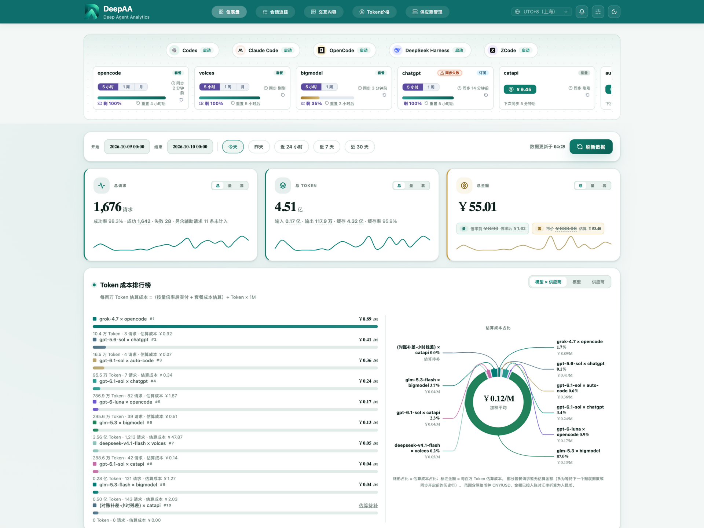
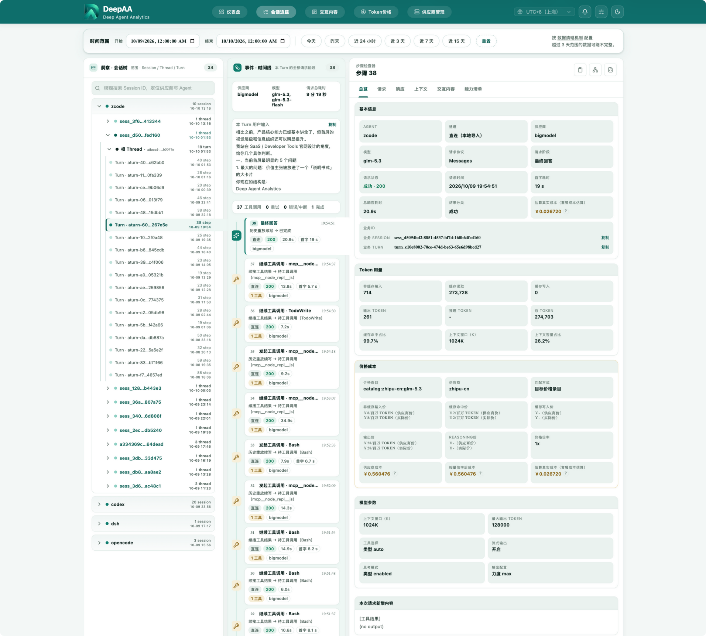
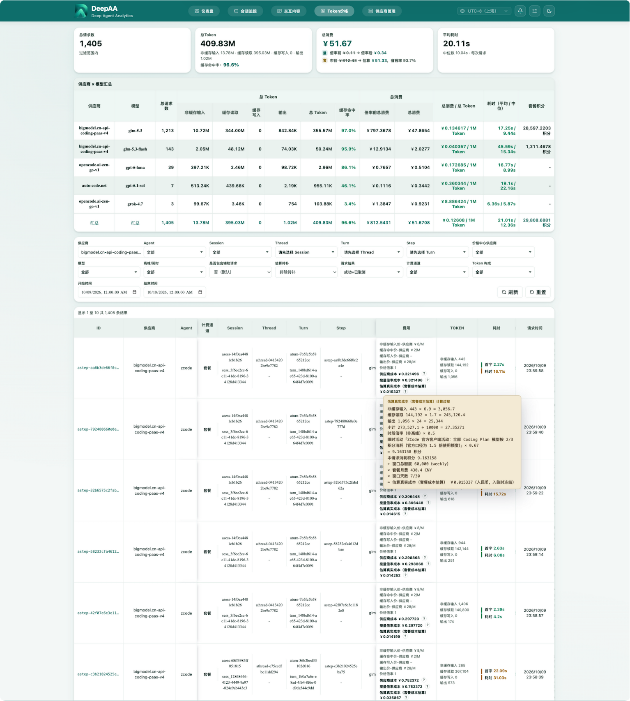
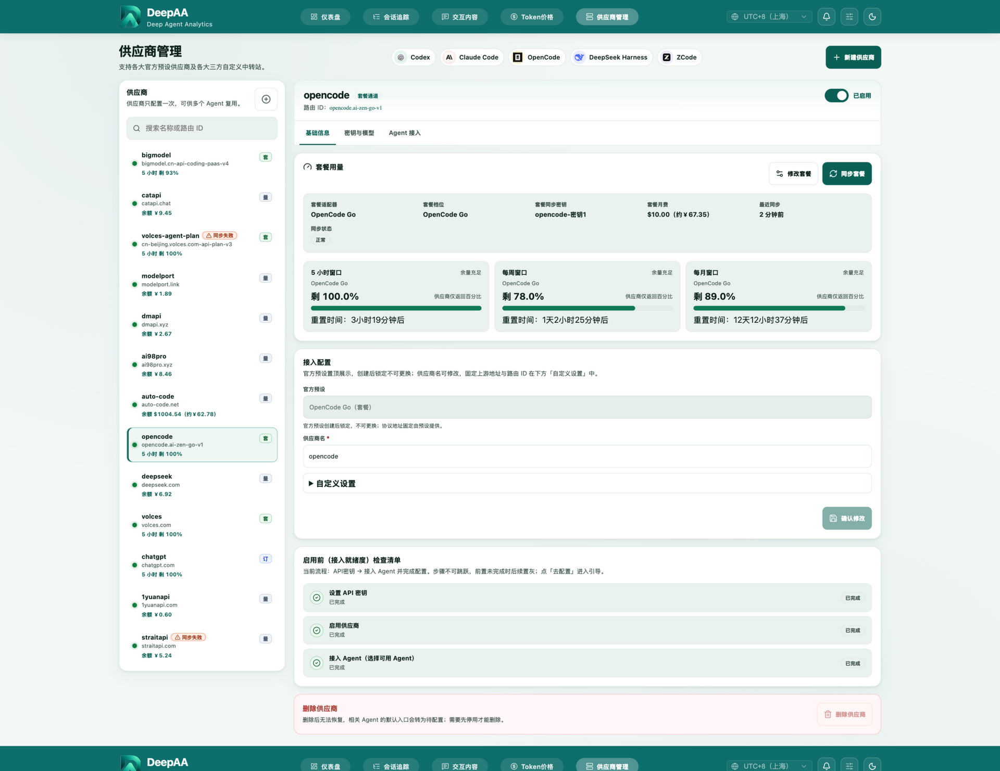

# DeepAA

**连接万千模型，洞察每次调用，算清所有成本，让 Agent 不再是黑盒。**

DeepAA（Deep Agent Analytics）是开源、本地运行的 **AI Agent 网关与可观测分析平台**。它把官方定价、套餐订阅、中转倍率与优惠规则拆到具体请求，让你看到用量、费用和计算依据；同时统一管理供应商与 Agent，追踪 Agent 跟模型之间的链路调用，配置多模型故障转移。

[官网与产品预览](https://deepaa.dev/zh-CN) · [安装与接入指南](https://deepaa.dev/zh-CN/docs) · [English](./README_en.md) · [MIT 许可证](./LICENSE)

## 界面一览

**仪表盘** —— Agent 一键启动、供应商余额与套餐余量、多维成本分析，数据全程留在本机。

<p align="center">
  
</p>

<table align="center">
  <tr>
    <td align="center" valign="top">
      <a href="docs/screenshots/sessions.png"></a>
      <br><br><sub><b>会话追踪</b> · Session → Thread → Turn → Step 调用链</sub>
    </td>
    <td align="center" valign="top">
      <a href="docs/screenshots/token-pricing.png"></a>
      <br><br><sub><b>Token 价格</b> · 逐请求费用与逐步计算公式</sub>
    </td>
    <td align="center" valign="top">
      <a href="docs/screenshots/proxy-management.png"></a>
      <br><br><sub><b>供应商管理</b> · 目标、密钥与模型、Agent 接入</sub>
    </td>
  </tr>
</table>

<p align="center"><sub>点击缩略图可查看大图</sub></p>

## 核心价值

使用多个 Agent、模型和供应商时，账单总额很难解释「哪次任务花了多少钱、为什么」。缓存单价、套餐额度、订阅窗口、中转倍率和优惠规则，又让不同服务的成本难以直接比较。DeepAA 把这些规则、请求记录和配置入口放到同一个本地工作台。

| 核心能力 | 你能得到什么 |
| --- | --- |
| **逐请求的成本透明** | 拆解非缓存输入、缓存读取、缓存写入与输出费用，查看命中的单价、倍率、结算系数、套餐消耗规则及计算公式；按模型、供应商、Agent 和时间范围汇总比较。 |
| **统一供应商与 Agent 接入** | 集中查看已接入供应商的余额与套餐余量，管理模型和密钥；启用 CLI 同步后免手改受管配置，在同一 Agent 中使用不同供应商的可用模型。 |
| **Agent 到模型的调用追踪** | 沿 Session → Thread → Turn → Step 还原任务与子 Agent 的调用关系，统一查看提示词、模型输出、工具交互、Token、耗时与请求证据。 |
| **模型与计费规则更新通知** | 跟随已发布的模型目录，获知新模型、价格、套餐、活动与能力规则变更，查看版本、前后差异及当前已使用模型的影响。 |
| **模型级故障转移** | 为「模型 × 供应商」设置有序备份链，配合失败阈值、备份粘性和恢复探测，降低模型或通道异常对编码工作的影响。 |

观测数据在本机保存与分析，不上传 DeepAA 云端；模型请求仍发送给你选择的供应商。无需修改 Agent 源码或加入观测 SDK。

## 一键安装（推荐，无需克隆仓库）

以 npm CLI 形式安装。一键脚本会自动完成：检查/安装 Node ≥ 22.13（自动选择国内 npmmirror / 官方源中更快的下载渠道）→ `npm install -g deepaa` → 自动启动并打开控制台 `http://127.0.0.1:3210`。

```bash
# macOS（Terminal）
curl -fsSL https://deepaa.dev/install.sh | bash
```

```powershell
# Windows（PowerShell）
irm https://deepaa.dev/install.ps1 | iex
```

手动安装：`npm install -g deepaa`——安装完成后自动启动并打开控制台（未自动打开时运行 `deepaa`）。`DEEPAA_NO_LAUNCH=1` 跳过自动启动（一键脚本与手动安装同语义）；脚本另支持 `DEEPAA_MIRROR=cn|global` 强制下载渠道。

## 开始使用后的三步

1. 在「供应商管理」添加你使用的供应商，选择按量、套餐或订阅通道，并配置可用模型与凭据。
2. 接入已安装的 Agent，选择默认供应商与模型，按需启用 CLI 配置同步；从仪表盘选择项目并快捷启动。
3. 在仪表盘看余额、套餐余量与多维统计，再进入会话追踪、交互内容或 Token 价格，查看某次请求的输入输出和费用依据。

## 从一次请求，看懂 AI 成本

DeepAA 的重点是让你能追溯「用了什么、适用什么规则、金额如何得出」，再把这些记录汇总到任务和全局。

| 计费通道 | 展示口径 |
| --- | --- |
| **按量** | 依据请求用量、匹配价格、密钥倍率与结算系数计价，展示分项和倍率前后金额；记录调用时的计费快照。 |
| **套餐与订阅** | 展示额度消耗、窗口、月费与折算依据，明确标注**成本估算**。积分、金额额度与百分比窗口按各自规则处理；依据不足时标记待补或不可估算。 |
| **中转站对账** | 支持的 sub2api / new-api 按量目标可核对站点明细，按证据与稳定性条件追加补差；原始账本和历史价格不改写。 |

常见 Token 计价与积分型套餐的计算示意：

```text
按量计价（原币种） = Σ（各类计费用量 × 该类适用单价 ÷ 1,000,000）× 密钥倍率
人民币展示金额 = 原币种金额 × 请求时冻结的结算系数

积分型套餐成本估算 = 套餐月费 ×（请求消耗积分 ÷ 窗口总积分）×（窗口天数 ÷ 30）
```

输入、缓存与输出使用各自的计费单价，避免重复计数；长上下文、时段、服务档位和活动规则由当次匹配结果决定。具体金额以请求的冻结计费记录为准，套餐公式是成本分摊估算，不代表供应商逐请求账单。百分比订阅额度可能使用窗口差分估算，页面会保留估算方式与依据。

价格中心按手工覆盖、目录官方价、LiteLLM 兜底的优先级提供计价依据，并区分不同供应商的同名模型。新价格用于后续匹配，历史请求保留原单价、倍率及结算系数。目录通知提供已发布规则的版本差异，更新时效取决于目录发布与同步。

## 支持的 Agent 与模型服务

当前已集成五种编码 Agent 的接入、受管配置同步与快捷启动：

| Agent | 网关协议 |
| --- | --- |
| **Codex** | OpenAI Responses |
| **Claude Code** | Anthropic Messages |
| **OpenCode** | OpenAI Responses / Chat Completions、Anthropic Messages |
| **DeepSeek Harness** | OpenAI Chat Completions / Responses、Anthropic Messages |
| **ZCode** | Anthropic Messages、OpenAI Chat Completions / Responses |

同一供应商可供多个 Agent 复用，同一 Agent 也可使用多个供应商的模型；可用组合取决于协议、模型能力和你显式配置的归属。余额、套餐同步与订阅透传以各供应商和 Agent 的支持范围为准。

观测通过本地网关捕获，或已支持的本地日志导入完成。Codex、ZCode 支持对应的官方直连日志导入；DeepSeek Harness 的本地日志用于补全原生会话身份，默认不作为独立计费导入源。原始 HTTP 报文仅来自网关捕获，任务层级以客户端可提供的身份和证据为依据。

CLI 同步写入前备份，只修改 DeepAA 受管字段并保留其它配置；首次接入仍需你选择供应商、模型和凭据。故障转移只在满足条件且尚未向客户端转发响应内容时重试，已经输出的流不会透明重放。

## 技术栈

- 框架：[Next.js 16](https://nextjs.org/) + [React 19](https://react.dev/)
- 语言：TypeScript 5
- 包管理器：pnpm
- 运行时：Node.js 22.13+ 或 23.4+（Node 内置 node:sqlite 驱动）；代理是原生 Node HTTP 独立进程
- 存储：一份本地 v2 raw JSONL/blob + 带索引的 SQLite 派生投影

## 快速开始（源码开发）

### 1. 安装依赖

```bash
pnpm install
```

### 2. 构建并启动服务

首次安装或源码变化后显式构建一次。`pnpm build` 会同时生成独立代理 bundle 和 Next.js 生产产物：

```bash
pnpm build
```

正常启动不会隐式执行构建（`pnpm start` = 裸 `deepaa` 智能启动；前台运行用 `pnpm open`）：

```bash
node ./bin/deepaa.mjs
# 或
pnpm start
```

代理和 Web 是两个独立 OS 进程，可以分别启动；任一进程退出时，启动器不会停止或重启另一个：

```bash
node ./bin/deepaa.mjs proxy
node ./bin/deepaa.mjs web
# 安装命令后的等价写法
deepaa proxy
deepaa web
```

代理只需要 `dist/proxy/proxy-server.mjs`，不依赖 `.next`、Next.js、SQLite 或正在运行的 Web UI。`web` 命令要求已有 `.next` 生产产物，缺失时只会让 Web 独立失败。

开发时可以先构建代理 bundle 再启动组合模式，也可以在两个终端分别启动代理和 Web：

```bash
pnpm build:proxy
pnpm dev
# 或分别在两个终端运行（脚本名与 deepaa 命令同名）
pnpm dev:proxy
pnpm dev:web
```

旧版生产参数 `--prod` 仍作为生产模式别名兼容，但同样不会执行构建：

```bash
node ./bin/deepaa.mjs --prod
```

安装为命令后，macOS 和 Windows 均可使用：

```bash
deepaa
```

裸 `deepaa` 是一个短命智能启动器：检测 3210/3211 端口，缺失的服务以后台守护方式补齐，等 Web 就绪后自动打开浏览器，然后自身退出——关闭终端或浏览器不影响运行中的服务。需要传统前台方式时使用 `deepaa open`（Ctrl-C 停止 Web 与代理进程，代理有界排空）。

可选的登录自启与崩溃自愈（仅显式用户动作注册；配置变更绝不重启代理）：

```bash
deepaa service install    # 注册并立即启动用户级服务（macOS LaunchAgent，Windows 每用户计划任务）；就绪后自动打开一次控制台
deepaa service start      # 启动已注册的服务（缺的加载、空闲的唤醒），并打开控制台
deepaa service restart    # 重启 Web 与代理服务，并打开控制台
deepaa service status     # 查看 Web 与代理服务的运行/注册状态
deepaa service uninstall  # 注销服务，不再开机自启；运行中的 Web 与代理服务不受影响，如需停止执行 deepaa stop
deepaa stop               # 停止 Web 与代理服务（已注册系统服务时仅停止当前运行，注册保留，下次登录自动运行）
deepaa status             # 只读查看 Web 与代理服务状态
```

macOS 系统设置 → 登录项中，两个服务显示为一条归组行（如 "Node.js Foundation — 2 个项目"）：后台项按可执行文件的**代码签名团队**归组，而服务运行的是本机安装的官方 node 二进制。若机器上还有其它同样把 LaunchAgent 指向裸 node 二进制的工具，会并入同一组（项目数相应增加）——这是 macOS 的展示层机制，npm 本地生成的服务无法改变。在系统设置中关闭该开关是 macOS 的「停用」语义：立即停止进程、下次登录不再自启（注册文件保留）；`deepaa status` 对「已注册但未运行」的提示文案已涵盖此情况。置灰后随时可执行 `deepaa` 使用服务；若系统拒绝拉起系统服务，将自动退回后台守护方式运行。

浏览器行为：用户触发的启动/重启会打开一次 `http://127.0.0.1:3210`；登录自启默认静默；崩溃自愈绝不弹页。启动是经过验证的——`service install` / `service start` 会等待端口真正监听并逐服务报告状态（附日志路径），不再「发出指令即报成功」。

桌面启动图标随 `npm install -g deepaa` 自动安装（macOS 的 `DeepAA.app`：点击后在默认终端执行 `deepaa`，命令结束后自动关闭该终端标签页；Windows 创建开始菜单快捷方式），无需手动安装；若图标缺失，直接运行 `deepaa` 会自动补齐。移除：

```bash
deepaa icon uninstall
```

完整命令清单：`deepaa help`。

默认本地地址：

- Web UI: `http://127.0.0.1:3210`
- Proxy: `http://127.0.0.1:3211`

默认只监听 `127.0.0.1`。这是有意设计，因为捕获数据可能包含 API Key、Cookie、系统提示词、用户输入和模型输出。

### 3. 将客户端请求导向本地代理

打开“供应商管理”，先创建可复用的供应商目标。一个目标可以配置 OpenAI 兼容上游 URL、Anthropic 兼容上游 URL，或同时配置两者；它们只是请求数据组织格式，不是供应商分类。模型和系统密钥由目标共享，并可按已接入的 Agent 设置归属。

新安装默认不接入任何 Agent。用户只接入实际使用的 Agent，再显式选择该 Agent 的默认供应商、模型、密钥以及是否由 DeepAA 同步 CLI 配置。同一个供应商目标无需重复添加，可被多个 Agent 复用。

Claude Code 使用 Agent 专属网关入口：

```bash
export ANTHROPIC_BASE_URL=http://127.0.0.1:3211/claude
```

Codex / OpenAI 兼容客户端使用：

```bash
export OPENAI_BASE_URL=http://127.0.0.1:3211/codex/v1
```

请求通过带前缀模型 ID 选择供应商，例如 `myrelay_gpt-5.6`。第一个下划线前的路由 ID 只允许小写字母、数字、点和连字符。历史无 Agent 前缀路径一律拒绝，不存在隐式默认目标路由。

### 从供应商目标启动 Codex 或 Claude Code

接入 Agent 并补齐默认供应商、模型和密钥后，可在目标详情的 Agent 区块进入本地开发环境：

- OpenAI 协议目标显示“在 Codex 中开发”。该目标必须支持 Responses API。
- Anthropic 协议目标显示“在 Claude Code 中开发”。
- 选择项目目录后，模型按项目配置、显式 Codex Profile、用户全局配置的原生优先级解析；没有模型时必须手动填写。
- 新密钥只写入 macOS Keychain 或 Windows Credential Manager；浏览器后续只持有脱敏凭据 ID 和非秘密短指纹。
- CLI 同步只修改 `~/.codex/config.toml`、受管 Codex Catalog 和 `~/.claude/settings.json` 中由 DeepAA 声明管理的段落；写入前备份并保留用户其它配置。断开 Agent 或关闭同步时会清理旧受管内容。
- 代理地址与认证助手不会暴露真实密钥；Codex / Claude Code 统一走 3211 网关和带前缀模型 ID。
- 只有 Terminal.app 的完整启动命令达到 1024 UTF-8 字节时，才会在系统临时目录创建一次性私有启动计划并改用固定 Node 启动器；短命令、iTerm2 和 Windows 保持直接启动。该兜底不新增 macOS 授权，计划不含真实密钥，并在启动器领取后立即删除。
- DeepAA 只负责打开终端，不等待、不监听 Codex 或 Claude Code 的后续生命周期。Claude Code 仅额外使用一份不含密钥的私有临时 settings。

本地开发启动要求对应的 Codex CLI 或 Claude Code 已经安装到 PATH。macOS 支持 Terminal.app 和 iTerm2；Windows 支持 Windows Terminal 和 PowerShell。Windows 适配器已通过单元测试，但在完成真实 Windows 环境验收前不标记为已实测。项目自己的 AGENTS.md、CLAUDE.md、MCP、Hooks、Skills、Plugins 和权限配置仍由原 CLI 加载。

## 运行配置

| 环境变量 | 默认值 | 说明 |
| --- | --- | --- |
| `PORT` | `3210` | Web UI 和 API 服务端口 |
| `PROXY_PORT` | `3211` | 本地反向代理端口 |
| `HOST` | `127.0.0.1` | Web UI 和代理默认监听地址 |
| `PROXY_HOST` | `HOST` | 单独设置代理监听地址 |
| `DEEPAA_DATA_DIR` | 默认用户数据目录（`~/.deepaa`）；设置后强制覆盖，可指定 `<项目目录>/data` | 必须为绝对路径，供 raw、blob、SQLite 和本地配置共用 |
| `DEEPAA_DERIVATION_DISK_RESERVE_BYTES` | `2147483648` | 可用空间低于该保留值时 Worker 进入 `paused_disk` |

示例：

```bash
PORT=4000 PROXY_PORT=4001 node ./bin/deepaa.mjs
```

PowerShell 可使用以下等价写法：

```powershell
$env:PORT="4000"; $env:PROXY_PORT="4001"; node .\bin\deepaa.mjs
```

如果确实需要局域网访问，可以显式设置 `HOST=0.0.0.0`，但请先加好鉴权或网络访问控制。

### 仅维护使用：本地目录覆盖

`DEEPAA_CATALOG_PATH` 是官方目录维护人员专用的内部开关，用于加载本地草稿目录替代在线目录。
它不是面向用户的配置项，不得暴露到界面，也不得写入任何配置文件。

- 设置为**绝对路径**后，供应商目录只从该文件读取：**不联网、不写缓存文件**。
- 文件缺失或解析失败会**直接报错中止**（绝不静默回退正常模式，避免把未验证的目录误当已验证）。
- 生效期间 Web UI 顶部显示常驻「维护测试模式」横幅，通知弹窗的版本号标注「测试」。
- 未设置（默认）时行为与原先完全一致：远端 URL → 本地缓存 → 随包目录。

```bash
DEEPAA_CATALOG_PATH=/abs/path/to/pending.jsonl \
DEEPAA_DATA_DIR=/tmp/deepaa-catalog-test \
PORT=3310 PROXY_PORT=3311 \
node ./bin/deepaa.mjs
```

官网仓库通过 `pnpm catalog:test` 驱动上述流程，详见 `deepaa.dev` 的「目录「先测后发」工作流」。

### 目录缓存单调性守卫

远端成功返回的目录若比本地缓存更旧（例如 CDN 陈旧副本、误发低版本），将**拒绝覆盖**较新的缓存。
比较以 `publishedAt` 为主、`catalogRevision` 为次，与价格同步闸门 `catalogVersionNotNewer` 语义一致。

## 工作原理

```text
Agent / SDK / CLI
        |
        v
独立 Node 代理 -> 配置的上游 API 或中转站
        |
        +-> data/captures/v2/*.jsonl + data/blobs/
                    |
                    v
             异步 SQLite Worker
                    |
                    v
          data/deepaa.sqlite -> Next.js UI/API
```

代理会匹配目标、转发请求、把上游响应按原顺序透传给客户端，并在完成后只追加一条 v2 raw exchange。代理不导入 SQLite 或业务派生代码。Next.js Node 进程独立启动单写者 Worker，按完整 JSONL 行逐条事务化更新 SQLite；Worker 未启动、数据库锁定或派生失败都不能改变代理响应。

## Web UI

界面包含五个一级页面，其中三个数据页保持同一业务上下文：

- **仪表盘**：默认首页。顶部为 Agent 一键启动横排（Codex / Claude Code / OpenCode / DeepSeek Harness / ZCode）与供应商状态栏（套餐余量窗口 5 小时/周/月、按量余额与立即同步）；下方模块支持自定义排序：范围总览（总请求/总 Token/总金额，总·量·套三维度切换）、Token 成本排行榜、模型/供应商/Agent 三列分析、消耗趋势与构成、套餐/订阅供应商消耗、周期强度热力图。
- **会话追踪**：按“供应商目标 + Agent → Session → 递归 Thread → Turn → Step”查看调用链路、完整范围统计和按需原始证据。
- **交互内容**：按当前 Session、Thread、Turn 或 Step 分页还原提示词、模型输出和工具交互；页面预览有条数与字节上限，完整导出支持一键 Markdown / JSONL。
- **Token 价格**：按相同业务范围查看请求数、Token、倍率前后费用、平均耗时和请求明细；含中转站小时级对账补差面板。
- **供应商管理**：供应商目标侧栏 + 详情三页签（基础信息 / 密钥与模型 / Agent 接入）；新建供应商默认走官方预设向导（自动带入上游地址与目录模型），支持套餐用量同步、余额同步、价格倍率与 Agent CLI 配置联动。

数据页之间通过 URL 传播以下公共参数，参数在任何页面都保持同一含义：

| 参数 | 含义 |
| --- | --- |
| `target` | 供应商目标路由 ID |
| `agent` | Agent 大类 |
| `session` | 内部 Agent Session ID |
| `thread` | 内部 Agent Thread ID，子 Agent 通过父子 Thread 递归展示 |
| `turn` | 内部 Agent Turn ID |
| `step` | 内部 Agent Step ID；旧 `exchangeId` 链接只用于兼容恢复 |

在数据页之间切换时，当前单值业务路径会原样保留，页面自己的分页、游标、时间范围等参数不会串到其他页面。会话追踪支持用这六个参数直接恢复对应 Session、Thread、Turn 和 Step。

会话追踪汇总栏按当前选中的 Session、Thread 或 Turn 展示完整范围物化统计，Thread 统计包含所有后代 Thread：

- 总请求数，并拆分 Step 请求和辅助请求。
- 总 Token，并拆分非缓存输入、缓存读取、缓存写入、输出及缓存命中率。
- 总消费，区分倍率后实际费用、倍率前费用和已计价 Step 数。
- 平均耗时，显示有效耗时样本数且包含辅助请求。
- 工具调用总数、工具种类数和按调用次数排序的主要工具。

汇总栏只保留一个“查看本 Session/Thread/Turn”按钮。点击后会在当前标签页进入交互内容页，并严格清除当前层级以下参数。步骤栏会把实际调用次数、工具名称与请求中注册的工具 Schema 数分开显示，避免把“注册了工具”误认为“调用了工具”。会话树的目标/Agent、Session 和任意 Thread 都可以独立展开或折叠，包括当前活动路径。

没有明确 Session 身份的 `/models` 等元数据请求只计入供应商目标级辅助账本，不会创建伪 Session/Thread，也不会抢占首页最新会话；Token 价格页的目标级或时间范围汇总仍会计入这些请求。

原始请求页包含完整请求体、供应商目标、上游路径和可复制 `curl` 命令。原始响应页会展示代理链路，并尽量展示格式化 JSON；如果不是 JSON，则展示原始文本。对于支持的流式协议，还会展示流是否完整结束。

## 会话归属与范围查看

请求按 Agent 原生会话标识和可验证的调用关系，归属到 Session、递归 Thread、Turn 与 Step。模型或供应商切换不应把同一次任务简单拆成「每天每个模型一个会话」；原生身份不足时，页面保留可识别范围。

仪表盘按时间范围聚合；会话追踪按任务层级展开；交互内容与 Token 价格消费同一业务上下文。查看和导出前先选择 Session、Thread、Turn 或 Step，默认预览分页且有字节预算，受限结果会明确提示。

## 本地 API

Web UI 后端提供以下本地接口：

| 方法 | 路径 | 说明 |
| --- | --- | --- |
| `GET` | `/api/proxy-config` | 获取 V3 供应商目标、Agent 接入、全局本地网关地址和 revision |
| `PUT` | `/api/proxy-config` | 携带 `expectedRevision` 原子修改/删除目标或接入/断开 Agent |
| `GET` | `/api/development-launch/capabilities` | 检测本机 CLI、终端和凭据库能力 |
| `POST` | `/api/development-launch/select-directory` | 打开本机目录选择器 |
| `POST` | `/api/development-launch/preflight` | 有界解析项目/全局启动配置 |
| `GET/POST/DELETE` | `/api/development-launch/credentials` | 管理系统凭据库中的开发密钥引用 |
| `POST` | `/api/development-launch/start` | 构建无密钥直接命令并在本机终端启动 CLI |
| `GET` | `/api/agent-sessions` | 列出从抓包交换派生的 Agent 会话 |
| `GET` | `/api/agent-sessions/:sessionId/threads` | 分页读取根 Thread 或直接子 Thread |
| `GET` | `/api/agent-threads/:threadId/turns` | 分页读取一个 Thread 的 Turn |
| `GET` | `/api/agent-turns` | 列出 Agent Turn 及步骤摘要 |
| `GET` | `/api/agent-turns/:turnId/steps` | 分页读取 Step 和真实工具动作摘要 |
| `GET` | `/api/exchanges/:exchangeId` | 读取单条抓包交换的完整详情 |

这些接口只面向本地使用。

## 数据存储与安全

新数据会写入：

```text
data/captures/v2/capture-*.jsonl
data/blobs/<sha256-prefix>/<sha256>.body.gz
data/deepaa.sqlite
data/deepaa.sqlite-wal
data/deepaa.sqlite-shm
data/config/development-credentials.json
```

JSONL/blob 是唯一的原始证据副本。SQLite 只保存带索引的派生字段和 raw 字节引用，不重复保存完整提示词或响应正文。会话树、聚合、交互内容候选和 Token 价格必须先在 SQL 中过滤、游标分页和限流，选中单条引用后才按精确 offset 读取 raw/blob。

`deepaa.sqlite-wal` 和 `deepaa.sqlite-shm` 是 SQLite WAL 模式的正常运行文件。服务运行时不要单独删除或复制它们；备份数据库前应先停止服务，并保持数据库与 WAL 状态一致。

本版本不导入旧 capture，只处理启用后新写入的 v2 raw。旧 `data/derived/` 和 `data/indexes/` 不再由应用读取，也不会被自动删除。raw 同样不会自动清理；这些目录或证据的删除属于破坏性操作，必须另行检查范围并得到明确确认。

本地代理配置会写入：

```text
data/proxy-config.json
```

运行时 `data/` 默认被 git 忽略；唯一例外是随版本发布的脱敏 LiteLLM 价格快照：

```text
data/defaults/litellm-model-prices.snapshot.json
```

价格加载时优先使用本地最近成功导入的 `data/config/model-pricing.json`，服务启动和价格中心手动导入会继续尝试 GitHub。网络不可用时不会覆盖本地价格；只有本地配置不存在或损坏时才使用随版本发布的快照。除上述快照外，除非你已经完整检查并脱敏，否则不要发布或分享 `data/` 目录。

`data/config/development-credentials.json` 只保存凭据 ID、标签、目标和 SHA-256 短指纹；真实密钥只保存在操作系统凭据库。仅当 Terminal.app 启动命令达到 1024 UTF-8 字节时，Codex 或 Claude Code 才会使用不含真实密钥的一次性私有启动计划，固定启动器在启动 CLI 前删除该计划。Claude Code 的私有临时 settings 同样不含真实密钥；启动失败时立即删除，进程异常遗留由后续服务能力检测或启动按 24 小时阈值有界清理。

捕获数据可能包含：

- Authorization、API Key、Cookie 和自定义凭据。
- 系统提示词、用户提示词、工具输入和工具结果。
- 完整模型响应、SSE chunk、token 用量和服务商元数据。

安全建议：

- 默认保持只监听本机回环地址。
- 不要把 `PORT` 或 `PROXY_PORT` 暴露给不可信网络。
- 远程访问前先增加鉴权和网络访问控制。
- 分享日志或截图前先脱敏请求头和请求体。

已知安全边界：本期尚未实现 raw capture 认证头同步脱敏。Codex/Claude Code 通过本地代理发送的 `Authorization`、`X-Api-Key` 等认证头仍可能原样进入 raw capture；使用、备份或分享 `data/captures` 前必须按敏感数据处理。

## 项目结构

```text
.
├── bin/
│   ├── deepaa.mjs
│   ├── credential-helper.mjs
│   └── windows-credential.ps1
├── src/
│   ├── app/                 # Next.js 页面和有界 API
│   ├── components/          # Session/Thread 工作台与查看器
│   ├── lib/db/              # SQLite schema、游标与索引查询
│   ├── lib/ingestion/       # 有界 raw reader 与单写者 Worker
│   ├── lib/harness/         # 协议归一化与原始证据类型
│   ├── reverse-proxy.ts
│   ├── proxy-config.ts
│   ├── store.ts
│   └── instrumentation.ts
├── tests/
├── package.json
└── tsconfig.json
```

## 开发命令

```bash
pnpm build        # 显式构建代理 bundle 和 Next.js 产物
pnpm build:proxy  # 只构建 dist/proxy/proxy-server.mjs
pnpm proxy        # 只启动已构建的独立 Node 代理（= deepaa proxy）
pnpm dev:proxy    # tsx watch 热更新运行代理 TypeScript 入口（= deepaa dev proxy）
pnpm web          # 只启动已有的 Next.js 生产产物（= deepaa web）
pnpm dev:web      # 只启动 Next.js 开发服务（= deepaa dev web）
pnpm start        # 智能启动（= deepaa；后台补齐并打开控制台）
pnpm open         # 前台运行代理和 Web 生产服务（= deepaa open）
pnpm dev          # 前台运行已构建代理 + Next.js 开发服务（= deepaa dev）
pnpm test
pnpm typecheck
pnpm verify:node-only
```

## 常见问题

### Web UI 没有实时数据

确认客户端使用 Agent 专属网关入口和带前缀模型 ID：

```bash
export ANTHROPIC_BASE_URL=http://127.0.0.1:3211/claude
# 或
export OPENAI_BASE_URL=http://127.0.0.1:3211/codex/v1
```

同时确认 Agent 已显式接入、默认供应商/模型/密钥链完整、目标已配置所需上游 URL，且请求模型为 `<targetId>_<modelId>`。无 Agent 前缀的 `http://127.0.0.1:3211/v1/...` 路径会被明确拒绝。

如果 raw capture 持续增长但页面数据不更新，可以检查 Worker 状态和 SQLite 元数据：

```bash
curl -s http://127.0.0.1:3210/api/derivation-status
sqlite3 "${DEEPAA_DATA_DIR:-data}/deepaa.sqlite" \
  'select worker_status, worker_error, data_version from schema_meta where id=1;'
```

- `running`：Worker 正在处理或轮询新的 v2 raw 行。
- `idle`：当前没有待处理数据。
- `paused_disk`：可用空间低于 `DEEPAA_DERIVATION_DISK_RESERVE_BYTES`；释放空间或明确调整保留值后重启。
- `failed`：检查 `worker_error`、目录权限、数据库完整性和磁盘空间。代理与 Worker 隔离，此时代理仍应继续转发并写 v2 raw。

数据库异常后，应先停止 UI 再操作 SQLite 文件。保留 raw 原始证据；重建投影不需要、也不应向真实模型重放请求。

### 上游请求失败

检查上游 URL 是否正确，以及原始客户端是否仍然发送了必需的 API Key 或 Authorization 请求头。

### Responses API 流式请求提前结束

有些兼容服务暴露的是 `/v1/responses`，而客户端可能请求 `/responses`。这种情况下可以把上游 URL 配成带 `/v1` 的 base URL：

```text
https://api.example.com/v1
```

DeepAA 会避免重复拼接路径，所以 `/responses` 会变成 `/v1/responses`，而不是 `/v1/v1/responses`。

### Raw Request 或 Raw Response 为空

只有经过本地代理端口的请求才会有完整原始 HTTP exchange。请确认客户端使用了 Agent 网关入口，例如 Codex 的 `http://127.0.0.1:3211/codex/v1` 或 Claude Code 的 `http://127.0.0.1:3211/claude`，并使用带供应商前缀的模型 ID。

### 端口冲突

通过环境变量更换端口：

```bash
PORT=4000 PROXY_PORT=4001 pnpm start
```

## 当前限制

- 捕获数据有意保留完整内容，因此可能包含敏感信息。
- 暂未内置鉴权。
- SSE 事件会在响应流结束后写入存储，流未结束前详情可能还不可见。
- 启动器自身不做子进程监护；崩溃自愈依赖可选的用户级服务（`deepaa service install`，仅崩溃时自动恢复）。
- Windows 进程树和 rename 的真实行为仍需在 Windows 机器完成发布验收。

## 发版流程（npm publish）

发布版本 = 执行 `npm publish` 时 package.json 的 `version` 字段；同一版本号只能发布一次，发错只能升版本号重发。

```bash
npm version patch   # 1.0.0 → 1.0.1（bug 修复）
npm version minor   # 1.0.x → 1.1.0（新功能）
npm version major   # → 2.0.0（破坏性变更）
git push --tags && git push
npm publish
```

- `prepublishOnly`（`pnpm build && pnpm test:package`）会在 publish 前自动构建并跑安装冒烟，防止把过期 `.next` / `dist/proxy` 产物发出去。
- **首发 1.0.0 必须走 latest 通道**（普通 `npm publish` 即是）：npm 上的 `latest` 目前指向历史占位包 `0.0.1`（无 bin），首发后自动被取代。不要只用 `--tag beta` 发预发布版，否则 `npm install -g deepaa` 装到的仍是占位包。
- npmmirror 是 npmjs 的全量自动镜像，新版本发布后有**分钟级同步延迟**——发版后等几分钟再对外宣传。
- 发布后可用 `npm dist-tag ls deepaa` 与 `npm view deepaa version` 复核。

## 交流与反馈

<p align="center">
  
</p>
<p align="center"><sub>扫码加入 DeepAA QQ 交流群</sub></p>

## 作者

Created and maintained by AIAgentAndy.

Contact: AIAgentAndy001@gmail.com

## License

MIT
